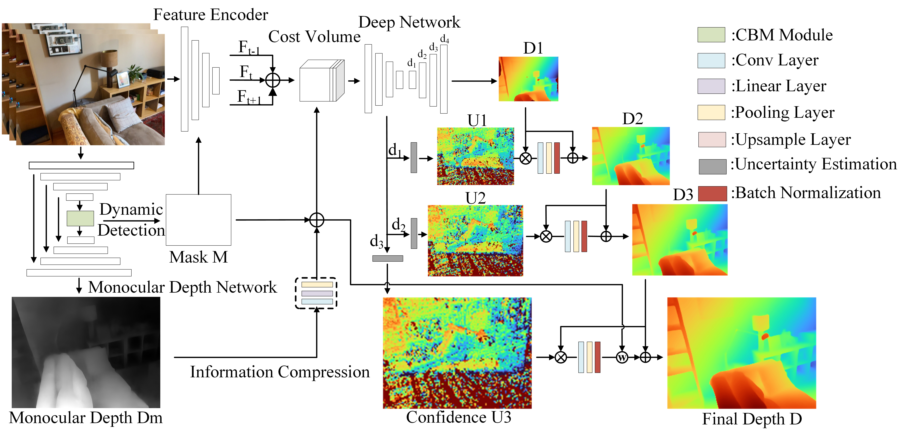

<<<<<<< HEAD
# BUCM
=======
# Monocular Depth Estimation Model Based on Uncertainty Constraints and Its Application in Augmented Reality                                                                                                                              

## Overview

This repository contains the implementation of the monocular depth estimation model based on uncertainty constraints proposed in the paper “Monocular Depth Estimation Model Based on Uncertainty Constraints and Its Application in Augmented Reality”. The model fuses single-view and multi-view depth estimation techniques to improve depth prediction accuracy and robustness in augmented reality (AR), especially enhancing occlusion handling at object edges through Bayesian uncertainty modeling.

The model framework is shown in the figure：




### Key Features

- **Fusion of Single-view and Multi-view Depth Estimation**: Enhances multi-view depth cost volumes with features extracted from single-view encoders, substantially improving prediction accuracy in dynamic and complex scenes.
- **Bayesian Convolutional Uncertainty Estimation (CBM)**: Introduces uncertainty constraints to better model depth uncertainty, improving robustness in occlusion regions.
- **AR Assembly Training System**: Development of a mobile AR parts assembly training system that leverages the model to achieve precise virtual-real occlusion for interactive component assembly tasks.
- **Datasets**: Validated on the ScanNet dataset, showing superior performance over several mainstream depth estimation methods and enabling high-precision virtual-real occlusion in AR.
### Experimental result diagram.

- ** Depth estimation result diagram.**


- ** Real-virtual occlusion effect diagram.**

  
- ** 3D point cloud reconstruction diagram.**

  
- ** AR application scenario diagram.**


The evaluation metrics for the depth estimation performance of our model on the ScanNet dataset are shown in the table below.


| Method                          | Type                     | Auxiliary         | AbsRel | RMSE  | δ₁   | δ₂   | δ₃   |
|---------------------------------|--------------------------|-------------------|--------|-------|------|------|------|
| Monodepth2 [Godard et al. 2019] | Single-View              | None              | 0.317  | 5.472 | 28.33| 47.41| 68.14|
| Packnet [Guizilini et al. 2020] | Single-View              | Semantics         | 0.287  | 4.715 | 33.72| 52.17| 72.15|
| CADepth [Yan et al. 2021]       | Single-View              | None              | 0.296  | 4.877 | 31.59| 51.35| 69.25|
| FSREDepth [Choi et al. 2020]    | Single-View              | Semantics         | 0.243  | 4.269 | 37.46| 58.66| 77.34|
| SC-depthV3 [Sun et al. 2023b]   | Single-View              | Pseudo Depth      | 0.227  | 3.871 | 43.57| 63.72| 84.97|
| BaseBoostDepth [Saunders et al. 2024] | Single-View       | None              | 0.186  | 3.454 | 49.71| 69.85| 88.21|
| DPSNet [Im et al. 2019]         | Multi-View               | None              | 0.080  | 2.991 | 49.36| 73.25| 93.27|
| MVDepth [Wang and Shen 2018]    | Multi-View               | None              | 0.085  | 3.432 | 46.71| 70.21| 92.77|
| DELTASS [Sinha et al. 2020]     | Multi-View               | None              | 0.079  | 2.767 | 48.64| 72.47| 93.78|
| GPMVS [Hou et al. 2019]         | Multi-View               | None              | 0.076  | 2.925 | 51.04| 74.59| 93.96|
| SimpleRecon [Sayed et al. 2022] | Multi-View               | Metadata          | 0.046  | 1.391 | 71.95| 83.65| 97.84|
| Watson [Watson et al. 2023]     | Multi-View               | None              | 0.048  | 1.349 | 70.33| 81.48| 97.75|
| Li et al. (2023a)               | Single & Multi-View      | None              | 0.057  | 1.812 | 68.74| 80.74| 95.25|
| AFNet [Cheng et al. 2024]       | Single & Multi-View      | None              | 0.044  | 1.447 | 71.44| 83.21| 97.35|
| Wang et al. (2024)             | Single & Multi-View      | Inertia           | 0.039  | 1.213 | 75.81| 87.69| 97.46|
| **Ours (Multi-View Only)**      | Multi-View               | Confidence        | 0.042  | 1.151 | 74.79| 88.71| 98.21|
| **Ours**                        | Single & Multi-View      | Confidence        | **0.035** | **1.002** | **77.38** | **90.25** | **98.41** |


  
The model demonstrates excellent performance in depth estimation, effectively handling occlusion issues, and shows great potential for applications in augmented reality (AR) scenarios.

## Installation

### Prerequisites

- Python 3.8+
- Conda (Anaconda or Miniconda)
- CUDA-enabled GPU (e.g., NVIDIA RTX3090)

### Setup

1. **Clone the repository**:

   ```bash
   git clone https://github.com/sdfsfwe/Virtual-Real-Occlusion.git
   cd Virtual-Real-Occlusion
   ```

2. **Create and activate the Conda environment**:

   The required dependencies are specified in the `env.yaml` file. To set up the environment:

   ```bash
   conda env create -f env.yaml
   conda activate multiview-depth
   ```

   This will install all necessary packages, including PyTorch, torchvision, NumPy, OpenCV, and others specified in `env.yaml`.

3. **Verify installation**:

   Ensure the environment is set up correctly by running:

   ```bash
   python -c "import torch; print(torch.__version__)"
   ```

4. **Download and preprocess datasets** (ScanNetV2):

   Follow instructions in `data/README.md` to set up the datasets.
   Please follow the instructions [here](https://github.com/ScanNet/ScanNet) to download the ScanNet dataset. This dataset is quite big (>2TB), so make sure you have enough space, especially for extracting files. 

## Training

   By default models and tensorboard event files are saved to `~/tmp/tensorboard/<model_name>`.
   This can be changed with the `--log_dir` flag.

   We train with a batch_size of 16 with 16-bit precision on two RTX3090 on the default ScanNetv2 split.

   Example command to train with two GPUs:

   ```shell
   CUDA_VISIBLE_DEVICES=0,1 python train.py --name HERO_MODEL \
            --log_dir logs \
            --config_file configs/models/hero_model.yaml \
            --data_config configs/data/scannet_default_train.yaml \
            --gpus 2 \
            --batch_size 16;
   ```

   The code supports any number of GPUs for training.
   You can specify which GPUs to use with the `CUDA_VISIBLE_DEVICES` environment.

   **Different dataset**

   You can train on a custom MVS dataset by writing a new dataloader class which inherits from `GenericMVSDataset` at `datasets/generic_mvs_dataset.py`. See the `ScannetDataset` class in `datasets/scannet_dataset.py` or indeed any other class in `datasets` for an example.

## Testing and Evaluation

You can use `test.py` for inferring and evaluating depth maps and fusing meshes. 

All results will be stored at a base results folder (results_path) at:

    opts.output_base_path/opts.name/opts.dataset/opts.frame_tuple_type/

where opts is the `options` class. For example, when `opts.output_base_path` is `./results`, `opts.name` is `HERO_MODEL`,
`opts.dataset` is `scannet`, and `opts.frame_tuple_type` is `default`, the output directory will be 

    ./results/HERO_MODEL/scannet/default/

Make sure to set `--opts.output_base_path` to a directory suitable for you to store results.

`--frame_tuple_type` is the type of image tuple used for MVS. A selection should 
be provided in the `data_config` file you used. 

By default `test.py` will attempt to compute depth scores for each frame and provide both frame averaged and scene averaged metrics. The script will save these scores (per scene and totals) under `results_path/scores`.

We've done our best to ensure that a torch batching bug through the matching 
encoder is fixed for (<10^-4) accurate testing by disabling image batching 
through that encoder. Run `--batch_size 4` at most if in doubt, and if 
you're looking to get as stable as possible numbers and avoid PyTorch 
gremlins, use `--batch_size 1` for comparison evaluation.

If you want to use this for speed, set `--fast_cost_volume` to True. This will
enable batching through the matching encoder and will enable an einops 
optimized feature volume.


```bash
# Example command to just compute scores 
CUDA_VISIBLE_DEVICES=0 python test.py --name HERO_MODEL \
            --output_base_path OUTPUT_PATH \
            --config_file configs/models/hero_model.yaml \
            --load_weights_from_checkpoint weights/hero_model.ckpt \
            --data_config configs/data/scannet_default_test.yaml \
            --num_workers 8 \
            --batch_size 4;

# If you'd like to get a super fast version use:
CUDA_VISIBLE_DEVICES=0 python test.py --name HERO_MODEL \
            --output_base_path OUTPUT_PATH \
            --config_file configs/models/hero_model.yaml \
            --load_weights_from_checkpoint weights/hero_model.ckpt \
            --data_config configs/data/scannet_default_test.yaml \
            --num_workers 8 \
            --fast_cost_volume \
            --batch_size 2;
```

This script can also be used to perform a few different auxiliary tasks.

## Point Cloud Fusion

We also allow point cloud fusion of depth maps using the fuser from 3DVNet's [repo](https://github.com/alexrich021/3dvnet/blob/main/mv3d/eval/pointcloudfusion_custom.py). 

```bash
# Example command to fuse depths into point clouds.
CUDA_VISIBLE_DEVICES=0 python pc_fusion.py --name HERO_MODEL \
            --output_base_path OUTPUT_PATH \
            --config_file configs/models/hero_model.yaml \
            --load_weights_from_checkpoint weights/hero_model.ckpt \
            --data_config configs/data/scannet_dense_test.yaml \
            --num_workers 8 \
            --batch_size 4;
```

Change `configs/data/scannet_dense_test.yaml` to `configs/data/scannet_default_test.yaml` to use keyframes only if you don't want to wait too long.


## Augmented Reality Parts Assembly Training System
The augmented reality system is developed using Unity3D, with EasyAR and OpenXR for augmented reality functionalities. The detailed process is described in the paper. You can access the virtual parts assembly system we developed via this link:https://pan.baidu.com/s/14JFzyMIO0pZoVglqojqp9A.Network disk extraction code:a5qq.

## Acknowledgements


We would like to express our sincere gratitude to Liu Jia, Wang Bin, Chen Dapeng, Li Yong Ze, Gao Peng from Nanjing University of Information Science and Technology for their invaluable support in both the code development and the paper. Their contributions have been crucial in advancing this project, and we greatly appreciate their guidance and collaboration.

>>>>>>> cce9ab7 (first commit)
